<table>
<tr>
<td width="50%" valign="top">

</td>
<td width="50%" valign="top">

</td>
</tr>
<tr>
<td width="50%" valign="top">

</td>
<td width="50%" valign="top">

<a href="https://github.com/raxjinn/raxjinn/issues/new?template=guestbook.yml">sign the guestbook →</a>

</td>
</tr>
</table>

<b>◤ What I actually work on</b>

 

**Medical imaging pipelines** — DICOM routing, modality integration, worklist orchestration. The part of healthcare IT where a dropped study is somebody's afternoon.

**Agent infrastructure** — multi-agent build systems, eval harnesses, and tooling that survives contact with production rather than demos well.

**Finance primitives** — ledgers, reconciliation, and the parts where "close enough" is not a number.

<b>◤ Stack</b>

 

| | |
|---|---|
| **Languages** | C#, Python, TypeScript, SQL |
| **Runtime** | .NET, Node, Docker |
| **Data** | PostgreSQL, ClickHouse, DICOM, HL7v2 |
| **Infra** | GitHub Actions, Cloudflare Workers |
| **Editor** | Neovim, Visual Studio |

